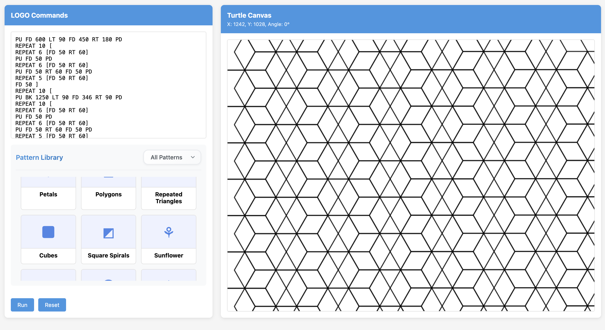

# Basic LOGO Interpreter

A browser-based LOGO programming interpreter built with HTML, CSS, and JavaScript. This tool allows users to write simple turtle graphics commands to draw geometric patterns and explore recursive art using the classic LOGO language.

## Features

- **Code Editor** with syntax support for basic LOGO commands
- **Live Turtle Canvas** for visual feedback and drawing
- **Pattern Library** with categorized examples like:
  - Basic Shapes: Triangle, Square
  - Geometric Art: Star, Flower, Polygons, Square Spirals
  - Fractals: Repeated Triangles
  - Tetromino: L- and T-shape style patterns
- **UI Controls**: Run and Reset buttons for command execution
- Shows turtle's position and direction
- Supports `REPEAT` syntax and nested command parsing

## Getting Started

### 1. Clone the Repository

```bash
git clone https://github.com/onlycodeblog/basic-logo-interpreter.git
cd basic-logo-interpreter
```

### 2. Open in Browser

Just open the `index.html` file in any modern browser, no server setup required.

## LOGO Commands Supported

```logo
HT         ; Hide turtle
ST         ; Show turtle
PD         ; Pen down
PU         ; Pen up
LT 90      ; Turn left
RT 90      ; Turn right
BK 100     ; Move backward
FD 100     ; Move forward
REPEAT n [commands]
```

## Project Structure

- `index.html` – Main UI layout
- `style.css` – Custom styling and responsive design
- `script.js` – LOGO interpreter and canvas rendering logic

## Preview



---
